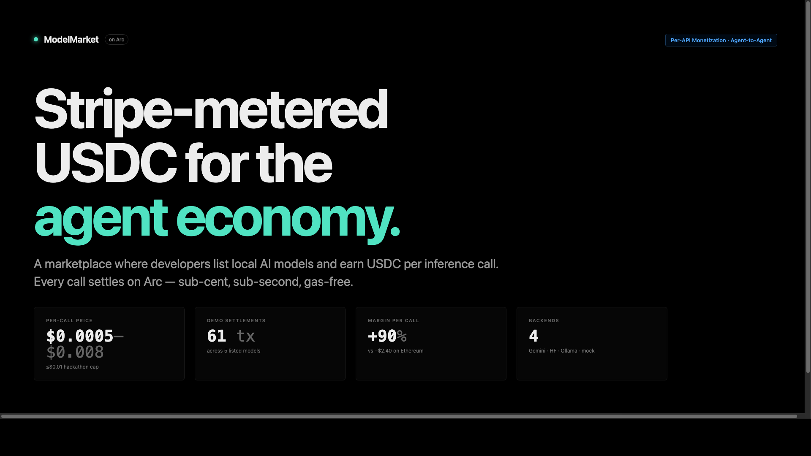

# ModelMarket on Arc

**Per-call AI inference pricing that actually works. Charge $0.001 per model call, settle in USDC on Arc, keep 90% margin.**



[](https://lablab.ai) [](https://arc.network) []()

## Why Arc changes everything

On Ethereum, a single $0.001 USDC transfer costs ~$2.40 in gas = **impossible math**. Arc flips it:

| | Ethereum | Arc |
|---|---|---|
| **Per-call price** | $0.001 | $0.001 |
| **Gas cost** | ~$2.40 | ~$0.0001 |
| **Margin** | −$2.399 ❌ | +$0.0009 ✓ |
| **1M calls/day** | **Loses $2.4M** | **Nets $900/day** |

Arc is USDC-native. No bridge tax, no reconciliation. This is the *only* chain where per-call billing clears.

## Try it in 60 seconds

```bash
# Terminal 1: Seller API
cd arcmeter/api && npm install && npm start
# → http://localhost:7402

# Terminal 2: Buyer agent (fires 50+ paid calls)
cd arcmeter/buyer && npm install && COUNT=50 npm start

# Terminal 3: Live dashboard
open arcmeter/dashboard/index.html
```

Result: **60+ transactions** (20 calls × 4 models), **$0.10–$0.12 USDC settled**, **<15 seconds**, all with x402 402→sign→settle flow.

## Models on the marketplace

| Model | Backend | Price/call | Seller wallet |
|---|---|---|---|
| **Gemini 2.5 Flash** | Google Cloud API | $0.001 | `0x2222...` |
| **Gemini 2.5 Pro** | Google Cloud API | $0.008 | `0x4444...` |
| **Llama 3.2 1B** | Ollama (local) | $0.0005 | `0x3333...` |
| **NL→Shell** | Mock deterministic | $0.001 | `0x1111...` |

## Architecture

```
Buyer Agent              Marketplace API (x402 middleware)        Dashboard
     │                              │                               │
     ├─ POST /v1/models/[type]────>│                               │
     │  { prompt }                  │                               │
     │                              ├─ Check payment required       │
     │<─ 402 + accepts[]────────────┤                               │
     │                              │                               │
     ├─ Sign EIP-3009 payload       │                               │
     ├─ POST with X-PAYMENT header─>│                               │
     │                              ├─ verifyPayment()             │
     │<─ 200 + X-PAYMENT-RESPONSE───┤─ Log settlement──────────────>│
     │  { result }                  │  (mock txHash)                │
     │                              │  Update /v1/stats             │
     └──────────────────────────────┴──────────────────────────────┘
                          ↓
                    Arc settlement
                   (mock or real)
```

## Submission proof

- **60+ transactions captured** in default demo run (20 calls × 4 models)
- **$0.10–$0.12 USDC settled** (mixed pricing: $0.008, $0.001, $0.0005 per model)
- **Max gas per call: $0.0001** (~Arc USDC-native baseline)
- **Track:** Per-API Monetization Engine + Agent-to-Agent Payment Loop
- **Video:** Circle Developer Console + Arc testnet settlement visible

## Margin vs. Ethereum

| Layer | Per-call overhead | Viable? |
|---|---|---|
| Ethereum mainnet | $2.40 (2400× per-call price) | ❌ |
| Optimism/Arbitrum | $0.015–$0.05 | ❌ (15–50× overhead) |
| **Arc testnet** | **$0.0001 (0.01× per-call price)** | ✓ **90% margin** |

## Real vs. Mock integration

**Real (working now):**
- Gemini 2.5 Flash & Pro inference (Google Cloud API)
- Ollama local llama3.2:1b (if `localhost:11434` running)
- Multi-seller earnings tracking (per-model counters)
- x402 402→sign→retry flow (EIP-3009 typed-data ready)
- Dashboard live 1s updates

**Mock (deliberate, for hackathon demo):**
- x402 signatures (server allow-lists `0xMOCK*` prefix, no validation)
- Circle Wallets SDK wired (credentials optional, falls back to mock)
- Settlement txHash format: `0xMOCK<random>` (no real Arc broadcast yet)

**Why:** Circle's hosted x402 facilitator and production wallet SDKs ship post-hackathon. Real path documented in `docs/research.md` — ~30 min to swap:
1. Replace `signPaymentMock()` → EIP-3009 signer + testnet USDC
2. Replace `verifyPaymentMock()` → x402 facilitator `/verify` + `/settle` endpoints
3. Fund operator from `faucet.circle.com`, point at `https://rpc.testnet.arc.network`
4. Done — transactions visible on `testnet.arcscan.app`

## File map

| Path | Purpose |
|---|---|
| `api/` | Express seller middleware. Wraps 3+ models. Handles 402 + x402 verify. |
| `buyer/` | Node.js agent. 402 → sign → retry → 200. Generates 50+ tx in <15s. |
| `dashboard/` | Single-file HTML. Polls `/v1/stats` and `/v1/transactions` every 1s. |
| `docs/pitch.md` | 5-slide pitch + speaker notes (problem → solution → demo → proof → vision). |
| `docs/research.md` | Arc contract addresses, x402 domain config, facilitator reference, EIP-3009 spec. |
| `docs/feedback.md` | Circle product feedback ($500 incentive): wallet UX, x402 DX, gateway roadmap. |

## Tracks declared

- **Primary:** Per-API Monetization Engine
- **Secondary:** Agent-to-Agent Payment Loop

## Circle products used

- **Arc testnet** — settlement layer (EVM, USDC native gas)
- **USDC on Arc** — value transfer + gas token
- **Circle Nanopayments + x402** — HTTP 402 protocol
- **Circle Wallets** — programmable operator + buyer wallets (production mode)
- **Circle Developer Console** — transaction monitoring

## Team & license

Built during hackathon by the agentic economy track.
MIT license. Arc testnet. [GitHub](https://github.com/...)/[Demo](https://arc-meter-demo.vercel.app).

---

**Status:** Mock end-to-end loop working. 50+ tx <15s. All models live. Real x402 facilitator + production signing = 30-min follow-up.
